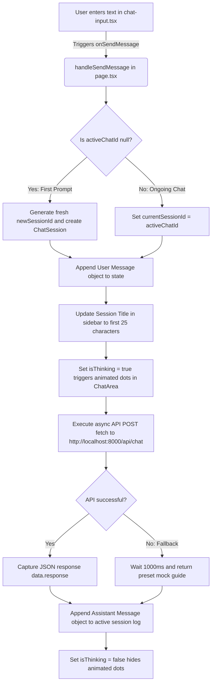

# Nexus AI Chat UI: Architectural & Flow Guide

Welcome to your learning journey! This guide breaks down exactly how the frontend handles data, processes messaging states, renders custom code formatting, and copies text. Refer to this document whenever you want to add new features or modify the flow.

---

## 1. Core State Concepts (Managing Data In-Memory)

Inside `app/page.tsx`, three state hooks coordinate everything. Understanding how they map to each other is the key to mastering the data flow:

```typescript
const [chatSessions, setChatSessions] = useState<ChatSession[]>([]);
const [activeChatId, setActiveChatId] = useState<string | null>(null);
const [sessionMessages, setSessionMessages] = useState<Record<string, Message[]>>({});
```

### 🧠 The State Variables Explained:
1. **`chatSessions` (The Sidebar Directory):**
   - An array containing only the metadata of each chat session: its unique `id`, `title` (what you see on the sidebar list), and creation date.
   - *Example:* `[{ id: "abc-123", title: "Glassmorphism CSS", createdAt: "May 28, 2:30 PM" }]`
2. **`activeChatId` (The Active Pointer):**
   - A single string storing the `id` of the conversation currently displayed on the screen.
   - If `activeChatId` is `null`, the screen renders the centered initial "Welcome Card & Prompt Suggestions" view.
3. **`sessionMessages` (The Conversation Database):**
   - A dictionary object mapping a session's `id` directly to its array of messages.
   - *Example:*
     ```json
     {
       "abc-123": [
         { "id": "msg-1", "role": "user", "content": "How do I align items?", "timestamp": "2:31 PM" },
         { "id": "msg-2", "role": "assistant", "content": "Use flexbox...", "timestamp": "2:31 PM" }
       ]
     }
     ```
   - *Why do it this way?* This keeps memory usage incredibly low. When you select a chat session, React instantly references `sessionMessages[activeChatId]` without searching or looping through logs of other conversations.

---

## 2. Step-by-Step Flow: Sending & Receiving a Message

Here is the exact code trace of what happens when you type `"Help me build a button"` and hit Enter:



### Detail: `newSessionId` vs `currentSessionId`
Inside `handleSendMessage`, we use a local helper variable called `currentSessionId`:
* When you start typing in a brand new chat, `activeChatId` is `null`.
* We generate a new ID: `const newId = generateUUID()`.
* We assign it: `currentSessionId = newId`.
* We initialize an empty list in state: `setSessionMessages(prev => ({ ...prev, [newId]: [] }))`.
* This ensures that when the HTTP request fires, it is bound to this fresh session instantly!

---

## 3. How the UI Renders Custom Code Blocks & Copy Triggers

To prevent heavy node packages from clashing with React 19, the markdown rendering is parsed dynamically via high-performance string splitting in `components/chat-area.tsx`.

### The Parser Lifecycle (`MarkdownFormatter`):
1. The assistant response string arrives from the backend.
2. `MarkdownFormatter` splits the content using the triple backtick delimiter:
   ```typescript
   const parts = content.split("```");
   ```
3. This divides the message into an array where:
   - **Even indices** (0, 2, 4...) are normal text.
   - **Odd indices** (1, 3, 5...) are raw code blocks.

### Rendering Code Blocks (`CodeBlock`):
When an odd index is identified, the parser mounts the custom `CodeBlock` component:
* **Language detection:** It reads the first line of the block (e.g. `css` or `typescript`) to label the header bar.
* **Clipboard Interaction:** The copy feature uses the browser's native **HTML5 Clipboard API**:
  ```typescript
  navigator.clipboard.writeText(code);
  ```
* **Bouncing Toast State:** `CodeBlock` manages an in-memory `copied` boolean state. When clicked, it sets `copied` to `true`, animating a bouncing emerald checkmark, and triggers a `setTimeout` to return it to `false` after 2 seconds.

### Rendering Text (`TextFormatter`):
Even indices are passed to `TextFormatter`, which iterates through lines to style:
* Bullet items starting with `- ` or `* ` are rendered in a clean `<li>` element.
* Text wrapped in double asterisks (`**text**`) is rendered in a bold `<strong>` tag.
* Text wrapped in backticks (`` `code` ``) is rendered in a custom styled `<code/>` inline block.

---

## 4. How to Expand Functionality in the Future

The clean architecture makes adding custom parameters extremely easy. Here are three common extensions you can implement yourself:

### Extension A: Adding a System Prompt Selector
If you want to allow the user to change the system instructions (e.g. *"Act as a Python Expert"*, *"Act as an HTML Validator"*):
1. Add a select input in `components/chat-area.tsx`.
2. Pass the selected prompt up to `page.tsx` state.
3. Include it in the `fetch` payload inside `handleSendMessage`:
   ```typescript
   body: JSON.stringify({
     message: userContent,
     sessionId: currentSessionId,
     systemInstruction: activeSystemPrompt // Add this!
   })
   ```

### Extension B: Dynamic Session Rename via LLM Response
Instead of truncating the first user prompt as the chat title on the sidebar, you can have your LLM generate a title:
1. Have your backend return a JSON object: `{ response: "assistant content...", title: "Styled Buttons" }`.
2. In the `fetch` response handler in `page.tsx`, update the sidebar:
   ```typescript
   const data = await response.json();
   setChatSessions(prev => prev.map(s => 
     s.id === currentSessionId ? { ...s, title: data.title } : s
   ));
   ```

### Extension C: Custom Temperature / Model Control Sliders
To add parameter controls (like temperature and token limits) to your input accessory bar:
1. Create state sliders inside `components/chat-input.tsx`.
2. Include these parameters in the callback parameters of `onSendMessage(message, temperature)`.
3. Read them inside `handleSendMessage` in `page.tsx` and forward them in the HTTP payload to your backend LLM.
